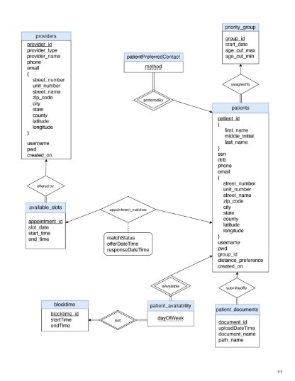

Amani Deepthi Matta : am10620 and Ralph Smith : rs6771 CS-GY 6083 Spring 2021 - Prof. Suel

CS-GY 6083 : Principles of Database Systems (Spring 2021)

Project 2

Amani Deepthi Matta : am10620 And Ralph Smith : rs6771

May 18, 2021

Contents

[Introduction ](#_page1_x90.00_y77.55)2 [Database Design](#_page2_x90.00_y77.55) 3 [Creating the Database](#_page4_x90.00_y77.55) 5 [Building the Web App](#_page6_x90.00_y77.55) 7 [Testing Data](#_page14_x90.00_y77.55) 15 [Web App walk-through](#_page19_x90.00_y77.55) 20 [Conclusion](#_page32_x90.00_y219.58) 33

Introduction

Covid has been a blight on the world. Luckily, in an unprecedentedly short amount of time, a num- ber of vaccines have been developed. It is now our job as database designers to help get everyone vaccinated as quickly and efficiently as possible.

Figure 1: Updated ER Diagram for Covid Vaccination Website

Database Design

Our Covid Vaccination Database uses nine tables. The major entities are: providers, priority groups, patients, appointments, available slots, patient documents, patients availability, and blocktime.

A provider can sign up on the website and then the administrator will activate their account after conrming the providers details. The provider can then upload available appointments to the sys- tem that get placed in a table called available slots. Available slots is a total, many-to-one entity to provider. Appointment matches is a relationship between patients and available vaccination slots.

A patient will be a member of a priority group. The patient is assigned a priority group by the administrator after they are added to the database. For our test system we used the patients age as the determining factor for which priority group they are a member of. A patient is also able to upload supporting documentation, which the administrator can use to upgrade their priority. A patient can also select which blocks of time they are usually free during the week.

The administrator will match patients with available vaccination slots by using the matching pro- cedure. There will be more discussion on the matching algorithm in a later section. Those matches will be stored in the appointment matches table. It stores all the information for any patients that have been matched with a vaccination slot. The attribute matchStatus can hold these six possible values: oered, accepted, declined, canceled, completed, and missed.

Figure 2: appointment matches table: matchStatus possible values owchart

We made blocktime, which divides a day into six four hour blocks, into a separate table. One rea- son is that it simplies the matching for available slots to patients. We can lookup which block a vaccination slot falls in and then match it to a patient with the same availability.

We tried to reduce redundancy in the database. We did this by limiting the tables to the major entities, or those attributes for which there may be multiple entries. As mentioned earlier, our table appointment matches holds all the important information about patient and appointment matches. In an earlier version, we considered making a separate table for all the patients that were vaccinated, but we realized we would be duplicating a lot of data from the appointment matches table.

Tables Primary Keys Foreign Keys

|priority group|group id|N/A|
| - | - | - |
|patients|patient id|group id REFERENCES priority group|
|patient documents|document id|patient id REFERENCES patients|
|blocktime|blocktime id|N/A|
|patient availability|patient id,blocktime id|blocktime id REFRENCES blocktime patient id REFERENCES patients|
|providers|provier id|N/A|
|available slots|
appointment d

i
|provider id REFERENCES providers|
|appointment matches|(appointment id, patient id)|appointment id REFERENECES available slots patient id REFERENCES patients|
|patient preferred contact|patient id, method|patient id REFERENCES patients|
Table 1: Relation Tables and Keys

Creating the Database

We used SQL Server to create our database. Amani used SQL SERVER Management Studio and Ralph used Azure Data Studio while running SQL SERVER in a docker container.

Figure 3: make tables.sql Part 1 of 2

Figure 4: make tables.sql Part 2 of 2

Building the Web App

Tech Stack used for the development of the project:

FRONT END:

HTML, CSS, JAVASCRIPT, BOOTSTRAP

SERVER SIDE:

PHP, APACHE server (Amani), PHP server (Ralph), Docker

DATABASE: SQL Server

IDE:

Visual Studio Code, SQL Server Management Studio(Amani), Azure Data Studio (Ralph)

THIRD PARTY APIs:

Google Maps JavaScript API, Google Maps Geocoding API

VERSION CONTROL: GitHub

How we worked together:

First we discussed all the features we wanted to include and then divided and assigned tasks. As we worked we updated our test cases and special features, rening our design as we went. As we progressed we tested each others code, discussed corner cases, and helped each other out as we got stuck.

Design Considerations:

Patient Matching Algorithm

The patient matching algorithm was designed to maximize the amount of slots oered to the highest priority patients. The outline of our patient appointment matching algorithm is as follows:

For each priority group:

Assign the matching appointments to all the people in the present priority To perform the matching we consider:

The patients' distance preference. We calculate the distance between each patient and provider using their latitude and longitude.

The patient's eligibility and availability should be within the range of available slots

During this matching we need to:

1) Get the appointments in appointment matches which are not part of (missed, completed, accepted)
1) From the matches, remove all the appointments with appointment id's that the patient has pre- viously declined or canceled
1) From the above result remove appointment matches for patients who have already accepted or completed the vaccination.
1) Remove all of the appointments that have already been oered while matching.
1) Repeat this process for every group starting from priority group 1 to group 6. This will ensure all of the matching slots are allotted to the highest priority group patients rst.

Figure 5: Matching Algorithm Part 1 of 5

Figure 6: Matching Algorithm Part 2 of 5

Figure 7: Matching Algorithm Part 3 of 5

Figure 8: Matching Algorithm Part 4 of 5

Figure 9: Executing Algorithm Part 5 of 5

Figure 10: Priority Group Algorithm

Figure 11: Transaction Example

Security Considerations:

1. Password Encryption:

We encrypted the password using the php function password hash() using the PASSWORD DEFAULT setting. The algorithm is BCRYPT with salting and it produces a 60 char long string. With salting, even if every user in our database had the same password, they would look dierent. It will make it harder for anyone that gets a hold of our database le to brute force our users passwords.

2. Prevention from cross site scripting attacks:

We have used htmlspecialchars() to avoid these attacks. We don't display any raw input from the user without cleansing it rst.

3. Prevention from SQL injection:

We only used prepared statements for every SQL query.

4. SESSION variables We used our SESSION state to control which pages a user can access. For instance, if a user doesn't have an active session, they cannot access the dashboards or any of the sign up pages or forms.

Figure 12: Password Encryption - All password: "123456789"

Figure 13: Cross Site Scripting Prevention

Figure 14: Prepared SQL execution example

Figure 15: Session Example to exclude access to page

Testing Data

To make the data for testing, we had to satisfy the following requirements with the data model:

1) Some patient must be available for vaccination slots by multiple providers
1) There must be a mix of patients from dierent priority groups that are waiting, scheduled, or have received their vaccination.
1) Some patients should be in dierent priority groups

Tables with test data:

Figure 16: Priority Group Test Data

Figure 17: Patients Test Data

Figure 18: Blocktime Test Data

Figure 19: Patient Availability Test Data

Figure 20: Providers Test Data

Figure 21: Available Slot Test Data

Figure 22: Appointment Match Test Data

Figure 23: Patient Preferred Contact table

Figure 24: Provider Preferred Contact table

Web App walk-through

Patient Sign Up

To sign up, a patient progresses through four pages. The patient signup is accessed from the in- dex.html page.

To add a new user one clicks on sign up now.

Figure 25: index.html

On the next page you will see the form a patient uses to add their contact info, preferred contact method, and to select a username and password. When the person signing up reaches this page a session is started in their browser.

Figure 26: Patient Sign Up Page 1

We used html form require statements for elds that had to be lled out. We also used regular expressions to validate individual form elds.

The Sign Up button at the bottom is deactivated until the form is lled out and both password elds match.

Before the record is inserted in the database we hash the password.

After the rst page is submitted, a javascript function is called that takes the address the user and calls Google's Geocoding API to get the latitude and longitude for the patient, which is then inserted into the database.

Figure 27: getLocation() Google Geocoding API call

Note: it is bad practice to store the api key in the function. It was done for expediency since this will never be public facing and I will destroy the key as soon as this is submitted.

Figure 28: Patient Sign Up Page 2

On the above page a patient can input when they are usually available during the week.

Figure 29: Patient Sign Up Page 3

Here patients can upload a jpeg, png, or pdf document smaller than 5mb. When a patient uploads the document, our system prepends the le name with the patients patient id number, uploads the le to a folder on the server, and saves the le name and le path in the database.

Figure 30: Patient Sign Up Page 4

This is the nal screen in the patient sign up process. When we reach this page the current active browser session is destroyed. You can see the inserted record below.

Figure 31: Added Patient Record Closeup Left

Figure 32: Added Patient Record Closeup Right

Patient Dashboard

Figure 33: Patient sign in

Logging in to the patient dashboard from index.html Here is where we see and current appointment oers.

Figure 34: Patient Dashboard - Oered Appointment

When the patient signs in, if they are not yet matched with an appointment, they may see oers. The patient may accept or decline the appointment. The may also see the providers location on a map by clicking locate on map.

Figure 35: Patient Dashboard - Accepted Appointment

If the patient has already accepted an appointment and has not yet cancelled it, they will see the appointment in their dashboard when they log in. They may click cancel and it will cancel the appointment. Just like for the oered appointments, you can locate a booked appointment on a map.

Figure 36: Patient Dashboard - Appointment Location

From the dashboard a patient may also update their contact info, contact preferences, and schedule availability.

Figure 37: Patient Dashboard - Update Contact and Preferred Contact Method

Figure 38: Patient Dashboard - Update Schedule

When the patient logs out it takes them to index.html and destroys their current browser session.

Provider Sign Up

Figure 39: index.html

To add a new user provider one clicks on sign up now. A new session is started when we reach the sign up page.

Figure 40: Provider Sign Up Page 1

Just like for patients, we used html form require statements for elds that had to be lled out. We also used regular expressions to validate individual form elds.

The Sign Up button at the bottom is deactivated until the form is lled out and both password elds match.

Before the record is inserted in the database we hash the password. Also, just like in patients, we use the entered address and call googles geocoding API to get the providers latitude and longitude for later comparing distances to patients.

Figure 41: Provider Sign Up Page 2

This nal page in the provider sign up thanks the provider for signing up and destroys the active browser session.

Figure 42: Added Patient Record Closeup Left

Figure 43: Added Patient Record Closeup Right

Provider Dashboard

Figure 44: Provider Sign In from index.html The providers log into their dashboard from index.html

Figure 45: Provider Dashboard

When the provider logs in they see a list of Upcoming and Past appointments. By clicking Add Vaccination Appointments at the top, they can add appointments to the system.

Figure 46: Provider Dashboard - Add Vaccination Appointments

When a provider is adding vaccination slots they specify the date of the appointment, the appoint- ments start and end time, and how many appointments they are oering at that time.

Figure 47: Provider Dashboard - Missed or Completed

Once the appointment has passed, the provider can select whether the patient completed or missed the appointment.

Our Extra Features

- Tie into google api for pulling latitude and longitude data
- Google map with markers for patient and provider
- Procedure for patient matching algorithm.
- Password Hashing and Session Management
- Document Upload
- Patient contact and schedule updating
- Provider appointment bulk uploads

Conclusion

Our web application will help in the ght against COVID-19. Together we can beat the virus.
32
